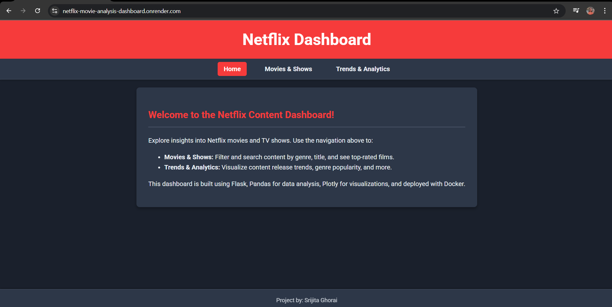
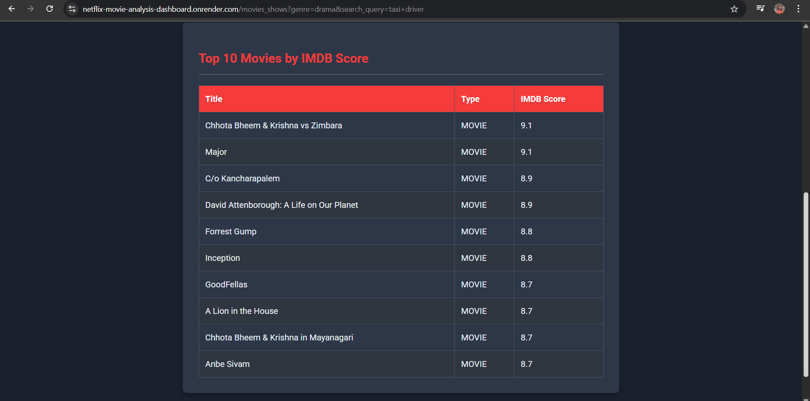
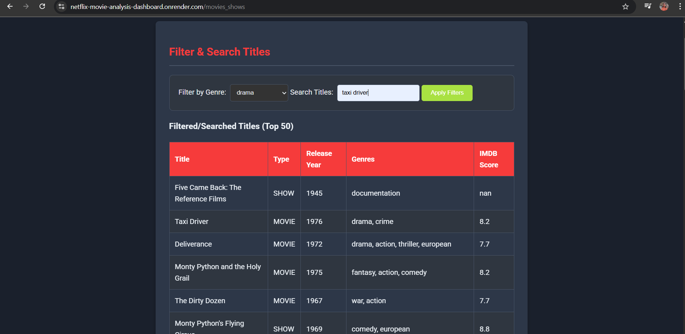
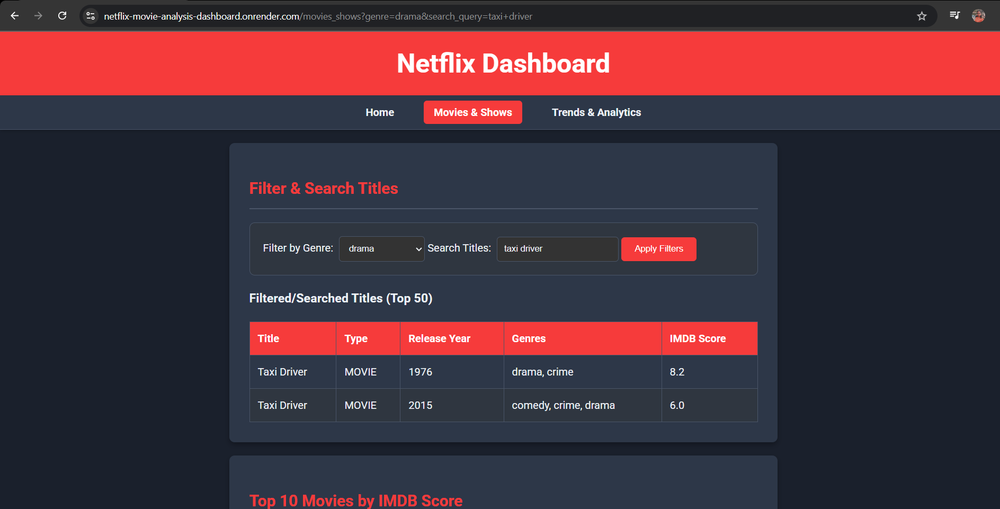
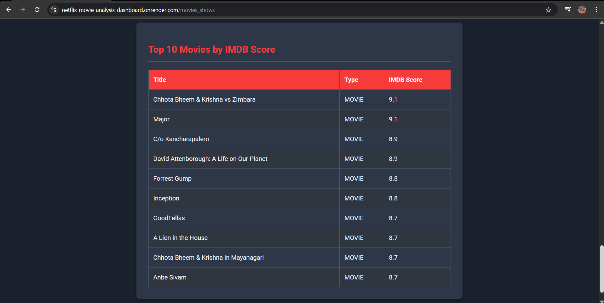

# Netflix Dashboard 



A web-based dashboard for exploring and analyzing Netflix content (movies and TV shows) using Flask, Pandas, and Plotly. This project is containerized with Docker for easy deployment.


## Overview

This project provides an interactive dashboard to visualize insights from a Netflix content dataset. Users can browse movies and TV shows, filter content, and explore trends over time through interactive charts. The application is built using Flask for the web framework, Pandas for data manipulation, and Plotly for dynamic visualizations. Docker is used to package the application and its dependencies, ensuring a consistent environment for deployment.

## Features

* **Home Page:** Welcome message and a brief overview of the dashboard.
* **Movies & Shows:** Browse and filter Netflix content by title, type, and IMDB score. Displays top 10 movies by IMDB score.
* **Trends & Analytics:** Visualizes release trends over years using interactive Plotly graphs. (Note: Graph lines were not consistently visible during initial local Docker runs, which might require further debugging.)

## Screenshots
### Movies & Shows Overview



*(This section displays a table of top-rated movies by IMDB score.)*


### Searching and Filtering



*(You can search for specific titles.)*




*(Filter content based on genres.)*


### IMDB Score Details



*(Detailed view of IMDB scores for filtered content.)*

## Dataset

- **Source**: [Netflix Movies and TV Shows Dataset (Kaggle)]( https://www.kaggle.com/datasets/victorsoeiro/netflix-tv-shows-and-movies?select=titles.csv)


## Technologies Used

* **Python 3.9**
* **Flask:** Web framework
* **Pandas:** Data manipulation and analysis
* **Plotly:** Interactive data visualizations
* **Gunicorn:** WSGI HTTP Server
* **Docker:** Containerization

## Setup and Local Development

### Prerequisites

* Python 3.9 installed (for running without Docker)
* pip (Python package installer)
* Docker Desktop installed and running (for running with Docker)
  

### Running Locally without Docker (for quick testing/development)

1.  **Clone the repository:**
    ```bash
    git clone [https://github.com/Srijita-31/Netflix-Movie-Analysis.git](https://github.com/Srijita-31/Netflix-Movie-Analysis.git)
    cd Netflix-Movie-Analysis
    ```
2.  **Navigate to the project directory:**
    Assuming your project files are in the root of the cloned repo:
    ```bash
    # You are already here if you cloned directly to this name
    ```
3.  **Create a virtual environment (recommended):**
    ```bash
    python -m venv venv
    ```
4.  **Activate the virtual environment:**
    * On Windows (PowerShell):
        ```bash
        .\venv\Scripts\Activate.ps1
        ```
    * On macOS/Linux:
        ```bash
        source venv/bin/activate
        ```
5.  **Install dependencies:**
    ```bash
    pip install -r requirements.txt
    ```
6.  **Run the Flask application:**
    ```bash
    set FLASK_APP=app.py # For Windows
    # export FLASK_APP=app.py # For macOS/Linux
    flask run
    ```
7.  Open your browser and navigate to the port url.

### Running Locally with Docker (Recommended for consistent environment)

1.  **Clone the repository:**
    If you haven't already:
    ```bash
    git clone [https://github.com/Srijita-31/Netflix-Movie-Analysis.git](https://github.com/Srijita-31/Netflix-Movie-Analysis.git)
    cd Netflix-Movie-Analysis
    ```
2.  **Navigate to the project root:**
    Ensure you are in the directory containing `Dockerfile`, `app.py`, `requirements.txt`, etc.
3.  **Build the Docker image:**
    This command builds the image, naming it `netflix-dashboard`.
    ```bash
    docker build -t netflix-dashboard .
    ```
4.  **Run the Docker container:**
    This runs the container and maps port `5000` from the container to port `5000` on your local machine.
    ```bash
    docker run -p 5000:5000 netflix-dashboard
    ```
    The terminal will show Gunicorn logs, indicating the server is running.
5.  Open your browser and navigate to `http://127.0.0.1:5000/`.
6.  To stop the container, press `Ctrl + C` in the terminal where it's running.

## Deployment

This application is designed for deployment using cloud platforms that support Docker, such as Render.

**Deployment on Render:** 

  **Access the deployed website here:** `https://netflix-movie-analysis-dashboard.onrender.com`
    

## Usage

* **Home Page:** Provides an introduction to the dashboard.
* **Movies & Shows:** Use the search bar and filters to explore Netflix content. The "Top 10 Movies by IMDB Score" is displayed.
* **Trends & Analytics:** Visualizes content release trends. 


